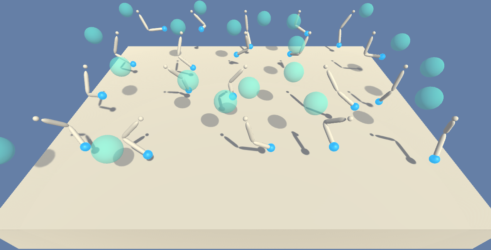

# UdacityRL-ReacherArmProject
Project Two Submission for Udacity Reinforcement Learning Course

In this environment each agent has four continuous valued actions corresponding to the torques applied at each arm joint.  The observation space includes the location of the target area for the end effector, as well as positions and velocities for the arm components.  A reward of +0.1 is assigned at each time step if the end effector is inside the target area.  To solve the environment, the running average, of the averages scores of all agents, over 100 episodes must reach at least 30.

## Environment Setup
+ Follow instructions [here](https://github.com/udacity/Value-based-methods#dependencies) to set up the environment, *with the following changes:*
  - Before running `pip install .`, edit `Value-based-methods/python/requirements.txt` and remove the `torch==0.4.0` line
  - After running `pip install .`, run the appropriate PyTorch installation command for your system indicated [here](https://pytorch.org/get-started/locally/)
  - Continue following the instructions [here](https://github.com/udacity/Value-based-methods#dependencies) to their conclusion.
+ Download the appropriate Unity Environment for your platform:
  - [Linux](https://s3-us-west-1.amazonaws.com/udacity-drlnd/P2/Reacher/Reacher_Linux.zip)
  - [Mac OSX](https://s3-us-west-1.amazonaws.com/udacity-drlnd/P2/Reacher/Reacher.app.zip)
  - [Windows (32-bit)](https://s3-us-west-1.amazonaws.com/udacity-drlnd/P2/Reacher/Reacher_Windows_x86.zip)
  - [Windows (64-bit)](https://s3-us-west-1.amazonaws.com/udacity-drlnd/P2/Reacher/Reacher_Windows_x86_64.zip)
+ Place the Unity Environment zip file into any convenient directory, and unzip the file.
+ Create jupyter notebook instance from terminal with `jupyter notebook` command.  Navigate to `ReacherArmCode.ipynb` and follow the instructions there to train or evaluate an agent.
